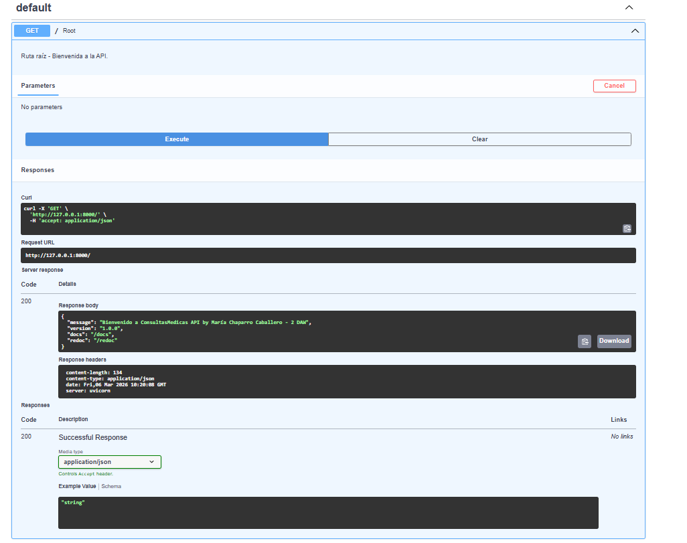
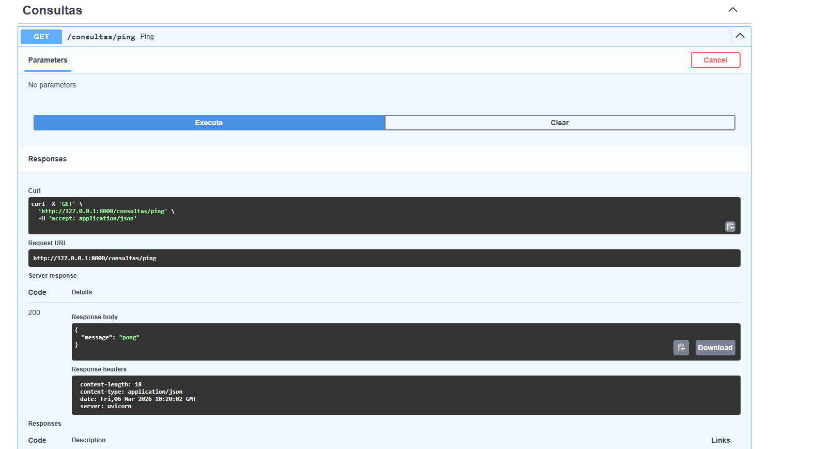
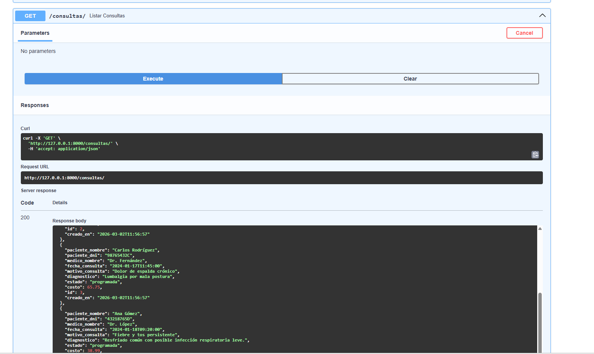
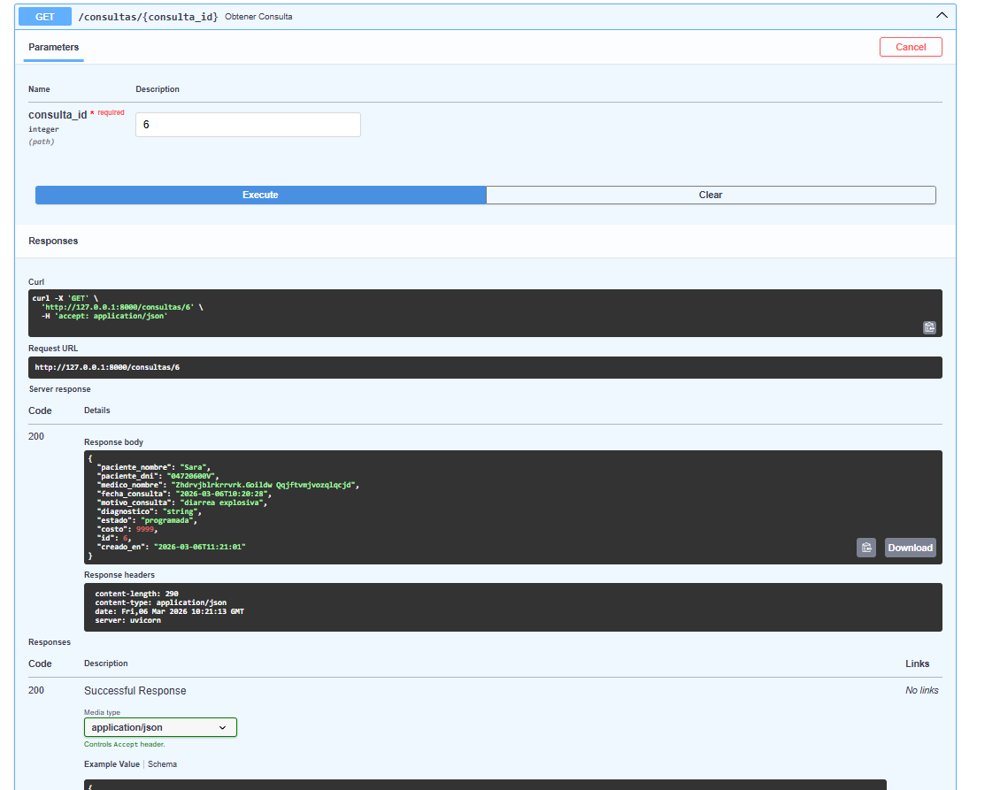
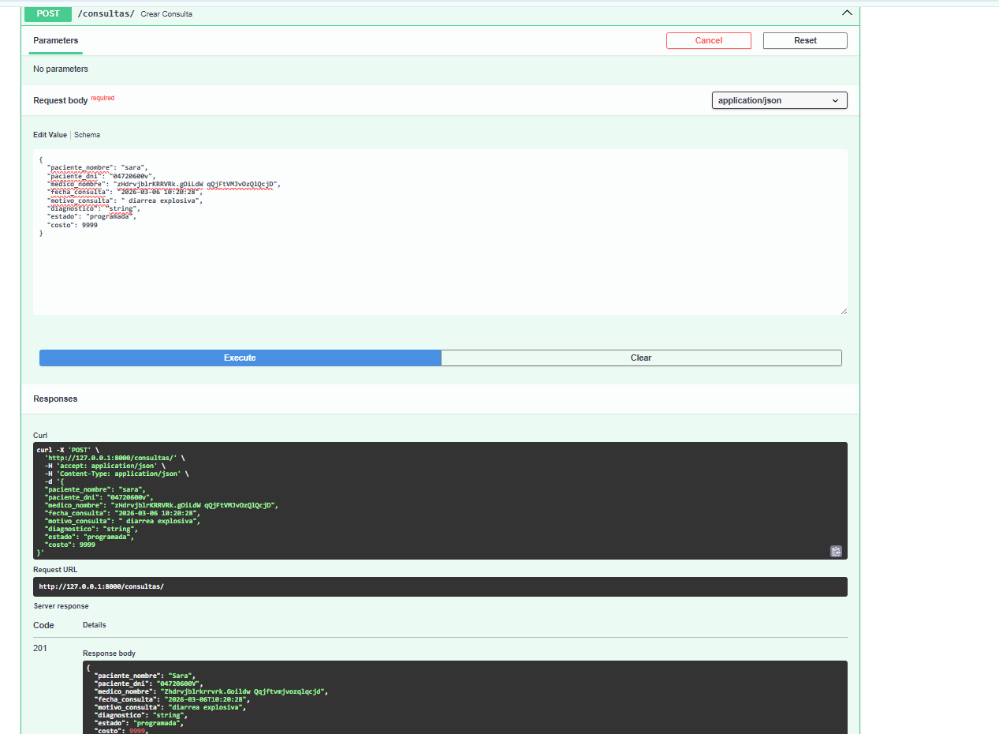
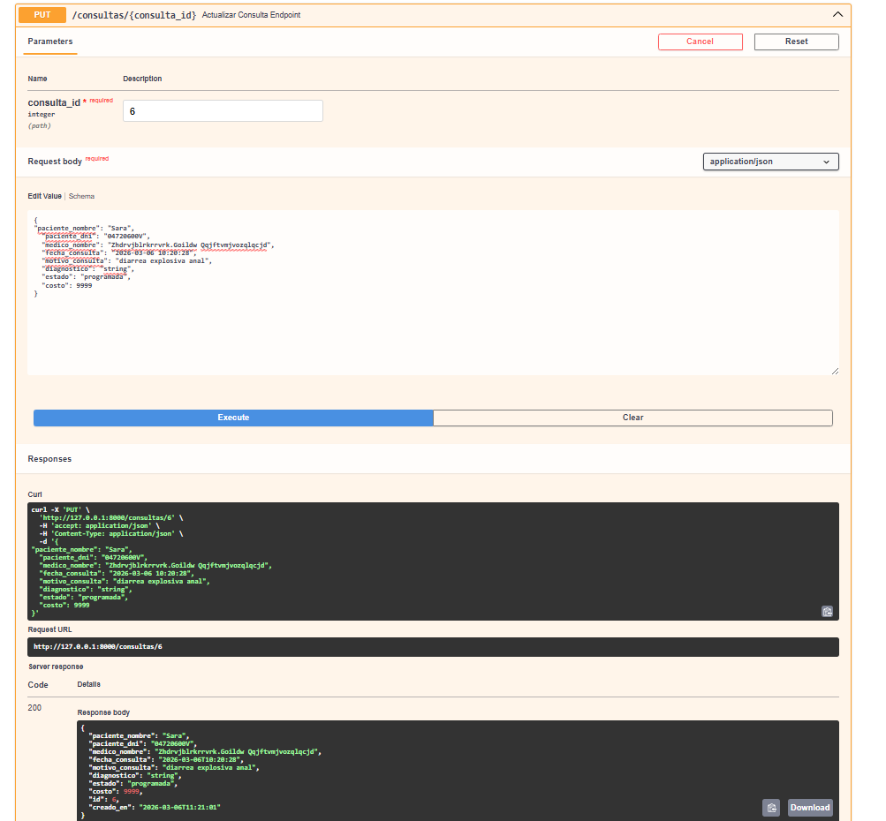
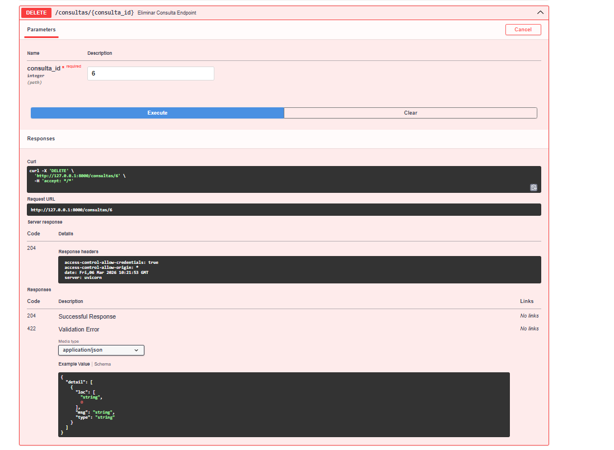

# 🏥 ConsultasApp API REST - Guía Educativa
## API de Gestión de Consultas Médicas
## Por María Chaparro Caballero
[Enlace de perfil de github:](https://github.com/MChaparroCaballero)

---

## 📖 Índice
1. [Caso de Uso: Centro Médico Sanitas](#-caso-de-uso-centro-médico-sanitas)
2. [El Problema a Resolver](#-el-problema-a-resolver)
3. [Especificación de la Base de Datos](#-especificación-de-la-base-de-datos)
4. [Estructura del Proyecto](#-estructura-del-proyecto)
5. [Arquitectura y Conceptos](#-arquitectura-y-conceptos)
6. [Librerías Python](#-librerías-python)
7. [Instalación y Ejecución](#-instalación-y-ejecución)
8. [Schemas (Modelos Pydantic)](#-schemas-modelos-pydantic)
9. [Routers (Endpoints)](#-routers-endpoints)
10. [Endpoints de la API](#-endpoints-de-la-api)
11. [Validaciones Pydantic](#-validaciones-pydantic)

---

## 🏢 Caso de Uso: Centro Médico Sanitas

### El Contexto
El Centro Médico Sanitas ha crecido rápidamente, atendiendo a cientos de pacientes semanalmente. Hasta hoy, la gestión de citas y diagnósticos se realizaba en hojas de cálculo compartidas, lo que generaba duplicidad de datos, pérdida de historiales clínicos y errores en el cobro de consultas.

### La Solución
Se ha desarrollado **ConsultasApp**, una API REST que centraliza la gestión de las consultas médicas, permitiendo que tanto el personal administrativo como los médicos puedan registrar, actualizar y consultar el estado de cada paciente de forma segura y eficiente.

---

## 🎯 El Problema a Resolver

Digitalizar el flujo de trabajo médico bajo un estándar **CRUD**, asegurando que:
- Los datos del paciente sean únicos (DNI).
- Los estados de la consulta sean consistentes (`pendiente`, `en proceso`, `finalizada`, `cancelada`).
- El coste de la consulta nunca sea negativo.
- La trazabilidad temporal (fechas de consulta y creación) sea automática.

---

## 📋 Especificación de la Base de Datos

### Script de Estructura (SQL)
La base de datos utiliza `utf8mb4` para soportar caracteres especiales y tildes en nombres y diagnósticos.

```sql
CREATE DATABASE IF NOT EXISTS ConsultasApp CHARACTER SET utf8mb4;
USE ConsultasApp;

CREATE TABLE `consultas` (
  `id` int(11) NOT NULL,
  `paciente_nombre` varchar(100) NOT NULL,
  `paciente_dni` varchar(9) NOT NULL,
  `medico_nombre` varchar(100) NOT NULL,
  `fecha_consulta` datetime NOT NULL,
  `motivo_consulta` varchar(255) NOT NULL,
  `diagnostico` varchar(255) DEFAULT NULL,
  `estado` enum('programada','confirmada','realizada','cancelada','no_asistio') NOT NULL DEFAULT 'programada',
  `costo` decimal(10,2) NOT NULL,
  `creado_en` timestamp NOT NULL DEFAULT current_timestamp()
);
```

---

## 📁 Estructura del Proyecto

```
python_SegundoTrimestre_Examen/
│
├── app/                          # Aplicación principal
│   ├── __init__.py              # Inicialización del paquete
│   ├── main.py                  # Aplicación FastAPI (rutas generales y configuración)
│   ├── database.py              # Capa de datos (funciones de repositorio)
│   │
│   ├── routers/                 # Enrutadores con lógica de endpoints (por dominio)
│   │   ├── __init__.py
│   │   └── consultas.py         # Endpoints CRUD de consultas
│   │
│   └── schemas/                 # Modelos Pydantic (definición de datos)
│       ├── __init__.py
│       └── consulta.py          # Esquemas y validaciones de consultas
│
├── docs/                         # Documentación
│   ├── init_db.sql             # Script para crear la BD
│   └── img/                     # Capturas de pantalla de endpoints
│       ├── actualizar.png       # PUT /consultas/{id}
│       ├── crear_consulta.png   # POST /consultas
│       ├── deafult.png          # GET / (raíz)
│       ├── eliminar.png         # DELETE /consultas/{id}
│       ├── listar_consultas.png # GET /consultas
│       ├── obtener_id.png       # GET /consultas/{id}
│       └── pingPong.png         # GET /consultas/ping
│
├── tests/                        # Tests de funciones de BD
│   ├── __init__.py
│   ├── test_delete_producto.py   # Test de eliminación
│   ├── test_fetch_all_productos.py # Test de listar todos
│   ├── test_fetch_producto_by_id.py # Test de obtener por ID
│   ├── test_get_connection.py    # Test de conexión
│   ├── test_insert_producto.py   # Test de inserción
│   └── test_update_producto.py   # Test de actualización
│
├── .env                         # Variables de entorno (NO incluir en git)
├── .gitignore                   # Archivos a ignorar en git
├── requirements.txt             # Dependencias del proyecto
└── README.md                    # Este archivo
```

---

## 🏗️ Arquitectura y Conceptos

La API implementa una **Arquitectura en Capas** para separar responsabilidades facilitando el mantenimiento:

### 🎯 Capas del Proyecto

1. **Capa de Presentación (FastAPI)** - `app/main.py`
   - Gestiona las rutas HTTP generales (raíz `/` y saludos `/ping`)
   - Configura CORS, middlewares y documentación automática
   - Incluye los routers organizados por dominio

2. **Capa de Enrutamiento (Routers)** - `app/routers/`
   - **`consultas.py`**: Define endpoints específicos del dominio "consultas"
   - Implementa lógica de recepción/validación y respuestas HTTP
   - Utiliza modelos Pydantic para validación automática
   - Maneja excepciones HTTP (404, 409, 500, etc.)

3. **Capa de Validación (Pydantic)** - `app/schemas/`
   - **`consulta.py`**: Define modelos de datos con validaciones
   - `ConsultaBase`: Modelo base con validaciones compartidas
   - `ConsultaCreate`: Hereda de Base para creación (POST)
   - `ConsultaUpdate`: Hereda de Base para actualización (PUT)
   - `ConsultaDB`: Modelo con ID (respuesta de BD)
   - Validadores personalizados (`@field_validator`) para reglas complejas

4. **Capa de Datos (Repository Pattern)** - `app/database.py`
   - Encapsula funciones que ejecutan SQL directo con `mysql.connector`
   - Abstrae la complejidad de consultas al resto de la aplicación
   - Funciones CRUD: `fetch_all_consultas()`, `insert_consulta()`, `update_consulta()`, `delete_consulta()`

---

## 📦 Librerías Python

Para el desarrollo de esta API se han seleccionado las siguientes herramientas:

* **FastAPI:** Framework moderno y de alto rendimiento para la creación de los endpoints.
* **Pydantic:** Motor de validación de datos basado en *Type Hinting* de Python.
* **Uvicorn:** Servidor ASGI de baja latencia para ejecutar la aplicación.
* **MySQL Connector:** Driver oficial para la comunicación fluida con MariaDB/MySQL.
* **python-dotenv:** Librería para gestionar credenciales y configuraciones sensibles de forma segura mediante archivos `.env`.

---

## 🚀 Instalación y Ejecución

Sigue estos pasos para configurar el entorno de desarrollo:

### 1. Clonar y preparar entorno
```bash
# Crear entorno virtual
python -m venv venv

# Activar entorno virtual
# En Windows:
venv\Scripts\activate
# En Linux/Mac:
source venv/bin/activate

# Instalar dependencias
pip install -r requirements.txt```

### 2. Configurar Variables de Env (.env)
```Crea un archivo llamado .env en la raíz del proyecto con el siguiente contenido:

DB_HOST=localhost
DB_USER=tu usuario
DB_PASSWORD=tu password
DB_NAME=ConsultasMedicasApp```

## 🚀 Instalación y Ejecución

Sigue estos pasos para configurar el entorno de desarrollo:

### 1. Clonar y preparar entorno
```bash
# Crear entorno virtual
python -m venv venv

# Activar entorno virtual
# En Windows:
venv\Scripts\activate
# En Linux/Mac:
source venv/bin/activate

# Instalar dependencias
pip install -r requirements.txt
```

### 2. Configurar Variables de Env (.env)
```
Crea un archivo llamado .env en la raíz del proyecto con el siguiente contenido:

DB_HOST=localhost
DB_USER=tu usuario
DB_PASSWORD=tu password
DB_NAME=ConsultasMedicasApp
```

### 3. Ejecutar la API
```bash
# Desde la terminal, utiliza el siguiente comando para iniciar el servidor en modo desarrollo:
uvicorn app.main:app --reload
```

La API estará disponible en `http://localhost:8000` con documentación interactiva en `/docs` y `/redoc`.

---

## 📦 Librerías Python

Para el desarrollo de esta API se han seleccionado las siguientes herramientas:

* **FastAPI:** Framework moderno y de alto rendimiento para la creación de los endpoints.
* **Pydantic:** Motor de validación de datos basado en *Type Hinting* de Python.
* **Uvicorn:** Servidor ASGI de baja latencia para ejecutar la aplicación.
* **MySQL Connector:** Driver oficial para la comunicación fluida con MariaDB/MySQL.
* **python-dotenv:** Librería para gestionar credenciales y configuraciones sensibles de forma segura mediante archivos `.env`.

---

## 🔍 Schemas (Modelos Pydantic)

Los **schemas** son modelos de datos definidos en `app/schemas/consulta.py` que actúan como **"contratos de datos"** entre el cliente y el servidor.

### Ventajas de los Schemas

✅ **Validación automática:** Pydantic valida datos antes de procesarlos  
✅ **Documentación clara:** FastAPI genera documentación automática  
✅ **Type hints:** Ayuda IDE y tipo seguridad  
✅ **Reutilizable:** Un modelo para múltiples endpoints  

### Modelos Implementados

```python
# 1. ConsultaBase: Modelo base con validaciones compartidas
class ConsultaBase(BaseModel):
    paciente_nombre: str  # Min 1, Max 100, solo letras y espacios
    paciente_dni: str     # Patrón: 8 dígitos + 1 letra (ej: 12345678Z)
    medico_nombre: str    # Min 1, Max 100, sin números
    fecha_consulta: datetime  # Formato: YYYY-MM-DD HH:MM:SS, >= año 2000
    motivo_consulta: str  # Min 10, Max 255 caracteres
    diagnostico: Optional[str] = None  # Opcional
    estado: str = "programada"  # Valores: programada, confirmada, realizada, cancelada, no_asistio
    costo: float  # >= 0, < 10000

# 2. ConsultaCreate: Para crear nuevas consultas (POST)
class ConsultaCreate(ConsultaBase):
    pass  # Hereda todas las validaciones de Base

# 3. ConsultaUpdate: Para actualizar consultas (PUT)
class ConsultaUpdate(ConsultaBase):
    pass  # Hereda todas las validaciones de Base

# 4. ConsultaDB: Respuesta desde BD (incluye ID)
class ConsultaDB(ConsultaBase):
    id: int
    creado_en: datetime
```

---

## 🔌 Routers (Endpoints)

Los **routers** son organizadores de endpoints agrupados por dominio. Se definen en `app/routers/` y se registran en `main.py`.

### Arqueo del Router de Consultas

```python
# app/routers/consultas.py

router = APIRouter(prefix="/consultas", tags=["Consultas"])
```

**Parámetros:**
- `prefix="/consultas"`: Todos los endpoints en este router empiezan con `/consultas`
- `tags=["Consultas"`: Agrupa endpoints en la documentación automática

### Endpoints Implementados

El router implementa los 5 endpoints CRUD principales + un health check:

| # | Método | Ruta | Descripción |
|---|--------|------|-------------|
| 1 | **GET** | `/consultas` | Obtiene todas las consultas |
| 2 | **GET** | `/consultas/{id}` | Obtiene una consulta por ID |
| 3 | **POST** | `/consultas` | Crea una nueva consulta |
| 4 | **PUT** | `/consultas/{id}` | Actualiza una consulta existente |
| 5 | **DELETE** | `/consultas/{id}` | Elimina una consulta |
| 6 | **GET** | `/consultas/ping` | Health check (verifica que la API esté activa) |

---

## 🔌 Endpoints de la API

### 🏠 Endpoints Generales

#### **GET /**
Ruta raíz que devuelve un mensaje de bienvenida y enlaces a documentación.

**Respuesta (200 OK):**
```json
{
  "message": "Bienvenido a ConsultasMedicas API by María Chaparro Caballero - 2 DAW",
  "version": "1.0.0",
  "docs": "/docs",
  "redoc": "/redoc"
}
```

**Captura:**


---

#### **GET /consultas/ping**
Health check para verificar que el servidor está activo.

**Respuesta (200 OK):**
```json
{
  "message": "pong"
}
```

**Captura:**


---

### 🏥 Endpoints de Consultas

#### **GET /consultas**
Obtiene el listado completo de todas las consultas médicas registradas.

**Respuesta (200 OK):**
```json
[
  {
    "id": 1,
    "paciente_nombre": "Juan Pérez",
    "paciente_dni": "12345678Z",
    "medico_nombre": "Dr. García",
    "fecha_consulta": "2025-01-15T10:30:00",
    "motivo_consulta": "Revisión médica general",
    "diagnostico": "Paciente en buen estado",
    "estado": "realizada",
    "costo": 50.0,
    "creado_en": "2025-01-20T14:23:45"
  }
]
```

**Captura:**


---

#### **GET /consultas/{id}**
Obtiene una consulta específica por su ID.

**Parámetros:**
- `id` (path): ID de la consulta (número entero)

**Respuesta (200 OK):**
```json
{
  "id": 1,
  "paciente_nombre": "Juan Pérez",
  "paciente_dni": "12345678Z",
  "medico_nombre": "Dr. García",
  "fecha_consulta": "2025-01-15T10:30:00",
  "motivo_consulta": "Revisión médica general",
  "diagnostico": "Paciente en buen estado",
  "estado": "realizada",
  "costo": 50.0,
  "creado_en": "2025-01-20T14:23:45"
}
```

**Errores:**
- `404 Not Found`: Si el ID no existe

**Captura:**


---

#### **POST /consultas**
Crea una nueva consulta médica con validación automática.

**Body (JSON):**
```json
{
  "paciente_nombre": "María López",
  "paciente_dni": "87654321A",
  "medico_nombre": "Dra. Sánchez",
  "fecha_consulta": "2025-03-06 15:45:00",
  "motivo_consulta": "Dolor de cabeza persistente",
  "diagnostico": "Migraña tensional",
  "estado": "programada",
  "costo": 75.50
}
```

**Respuesta (201 Created):**
```json
{
  "id": 2,
  "paciente_nombre": "María López",
  "paciente_dni": "87654321A",
  "medico_nombre": "Dra. Sánchez",
  "fecha_consulta": "2025-03-06T15:45:00",
  "motivo_consulta": "Dolor de cabeza persistente",
  "diagnostico": "Migraña tensional",
  "estado": "programada",
  "costo": 75.5,
  "creado_en": "2025-03-06T16:20:00"
}
```

**Errores:**
- `422 Unprocessable Entity`: Validación fallida (campos inválidos)
- `409 Conflict`: DNI ya registrado
- `500 Internal Server Error`: Error de base de datos

**Captura:**


---

#### **PUT /consultas/{id}**
Actualiza una consulta existente. Verifica que exista antes de actualizar.

**Parámetros:**
- `id` (path): ID de la consulta a actualizar

**Body (JSON):** (Mismo formato que POST)
```json
{
  "paciente_nombre": "María López",
  "paciente_dni": "87654321A",
  "medico_nombre": "Dra. Sánchez",
  "fecha_consulta": "2025-03-06 15:45:00",
  "motivo_consulta": "Dolor de cabeza persistente",
  "diagnostico": "Diagnóstico actualizado",
  "estado": "realizada",
  "costo": 100.00
}
```

**Respuesta (200 OK):** (La consulta actualizada)
```json
{
  "id": 2,
  "paciente_nombre": "María López",
  "paciente_dni": "87654321A",
  "medico_nombre": "Dra. Sánchez",
  "fecha_consulta": "2025-03-06T15:45:00",
  "motivo_consulta": "Dolor de cabeza persistente",
  "diagnostico": "Diagnóstico actualizado",
  "estado": "realizada",
  "costo": 100.0,
  "creado_en": "2025-03-06T16:20:00"
}
```

**Errores:**
- `404 Not Found`: Si el ID no existe
- `409 Conflict`: Si el DNI ya pertenece a otro paciente
- `422 Unprocessable Entity`: Validación fallida

**Captura:**


---

#### **DELETE /consultas/{id}**
Elimina una consulta permanentemente. Verifica que exista antes de eliminar.

**Parámetros:**
- `id` (path): ID de la consulta a eliminar

**Respuesta (204 No Content):**
(Sin cuerpo de respuesta)

**Errores:**
- `404 Not Found`: Si el ID no existe
- `500 Internal Server Error`: Error al eliminar

**Captura:**


---

## 🛠️ Flujo de Datos en la API

Cada request sigue este flujo riguroso:

```
Requests del Cliente
      ↓
[FastAPI] Recibe el request
      ↓
[Pydantic] Valida datos con schemas (ConsultaCreate, ConsultaUpdate, etc.)
      ↓
[Router] Llama función de repositorio (insert_consulta, update_consulta, etc.)
      ↓
[Database] Ejecuta SQL directo contra MySQL
      ↓
[Router] Mapea resultados a ConsultaDB (convierte Decimal → float, etc.)
      ↓
[FastAPI] Serializa respuesta a JSON
      ↓
Response al Cliente
```

### Ejemplo: POST /consultas

1. Cliente envía JSON con datos de nueva consulta
2. **Pydantic (schemas)** valida automáticamente:
   - Nombres sin números, formato correcto
   - DNI patrón 8#1L
   - Fecha formato YYYY-MM-DD HH:MM:SS
   - Costo >= 0
   - Estado en lista de válidos
   - Motivo >= 10 caracteres
3. **Router (consultas.py)** ejecuta `insert_consulta()`
4. **Database (database.py)** inserta en MySQL
5. **Router** obtiene el registro creado con su ID
6. **Mapeo** convierte Decimal a float  
7. **Respuesta 201** devuelve ConsultaDB en JSON

---

## ✅ Validaciones Pydantic

Se describen a continuación las validaciones implementadas con **Pydantic V2** en el modelo `ConsultaBase`:

### Validaciones Básicas (Field)

- **`paciente_nombre`**: `min_length=1`, `max_length=100`, patrón `^[a-zA-ZÁÉÍÓÚáéíóúÑñ\s]+$`
- **`paciente_dni`**: `min_length=1`, `max_length=9`, patrón `^\d{8}[A-Za-z]$` (8 dígitos + 1 letra)
- **`medico_nombre`**: `min_length=1`, `max_length=100`, patrón `^[a-zA-ZÁÉÍÓÚáéíóúÑñ\s\.]+$`
- **`motivo_consulta`**: `min_length=1`, `max_length=255`
- **`diagnostico`**: Opcional, `max_length=1000`
- **`estado`**: `default="programada"`, valores válidos: `programada`, `confirmada`, `realizada`, `cancelada`, `no_asistio`
- **`costo`**: `Field(ge=0, lt=10000)` (no negativo, menor a 10000)
- **`fecha_consulta`**: Tipo `datetime`, validación de formato y año

### Validadores Personalizados (@field_validator)

#### 1. **validar_no_nulo_ni_vacio** (mode='before')
Bloquea valores `None` y cadenas vacías en campos críticos.

```python
Campos afectados: paciente_nombre, paciente_dni, medico_nombre, 
                  fecha_consulta, motivo_consulta, estado, costo

Ejemplo de rechazo:
• paciente_nombre = None ❌ → ValueError
• paciente_dni = "" ❌ → ValueError
• costo = None ❌ → ValueError
```

#### 2. **validar_nombres_estricto**
- Hace `strip()` para eliminar espacios
- **Bloquea números:** Si contiene dígitos → Error
- **Valida regex:** Solo letras, espacios y puntos
- **Convierte a Title Case:** "juan pérez" → "Juan Pérez"

```python
Campos afectados: paciente_nombre, medico_nombre

Ejemplos:
• "Juan123" ❌ → ValueError (contiene números)
• "juan pérez" ✅ → "Juan Pérez" (title case aplicado)
• "DR. GARCÍA" ✅ → "Dr. García"
```

#### 3. **limpiar_y_validar_dni**
- Hace `strip()` y `upper()`
- **Valida patrón:** `^[0-9]{8}[A-Z]$` (ej: `12345678Z`)

```python
Ejemplos:
• "12345678z" ✅ → "12345678Z" (convertido a mayúsculas)
• "1234567z" ❌ → ValueError (solo 7 dígitos)
• "123456789Z" ❌ → ValueError (9 dígitos)
```

#### 4. **validar_fecha_completa** (mode='before')
- Si es string, parsea con formato `YYYY-MM-DD HH:MM:SS`
- **Valida año >= 2000**

```python
Ejemplos:
• "2025-03-06 15:45:00" ✅ → datetime object
• "1999-12-31 23:59:59" ❌ → ValueError (year < 2000)
• "06/03/2025" ❌ → ValueError (formato incorrecto)
```

#### 5. **validar_motivo_largo**
- Hace `strip()` para eliminar espacios
- **Requiere >= 10 caracteres**

```python
Ejemplos:
• "Revisión médica general" ✅ (22 caracteres)
• "Dolor" ❌ → ValueError (5 caracteres, < 10)
```

#### 6. **validar_estado_lista**
- Hace `strip()` y `lower()` para normalizciónormalizción
- **Valida contra lista de valores permitidos**

```python
Estados válidos: ['programada', 'confirmada', 'realizada', 'cancelada', 'no_asistio']

Ejemplos:
• "PROGRAMADA" ✅ → "programada"
• "realizada" ✅ → "realizada"
• "en proceso" ❌ → ValueError (no en lista)
```

### Flujo de Validación Completo

```
Cuando se envía un POST con un JSON:

1. FastAPI recibe el JSON
2. Pydantic intenta crear ConsultaCreate(**json_data)
3. Se ejecutan validadores en orden:
   a. mode='before' validators (normalizacion previa)
   b. Field constraints (min_length, max_length, pattern, ge, lt)
   c. mode='after' validators (validacion final)
4. Si alguno falla → 422 Unprocessable Entity con detalle del error
5. Si todo OKk → Se procede a ejecutar función de BD

Ejemplo de respuesta 422:
{
  "detail": [
    {
      "loc": ["body", "paciente_nombre"],
      "msg": "Este campo no puede contener números",
      "type": "value_error"
    }
  ]
}
```